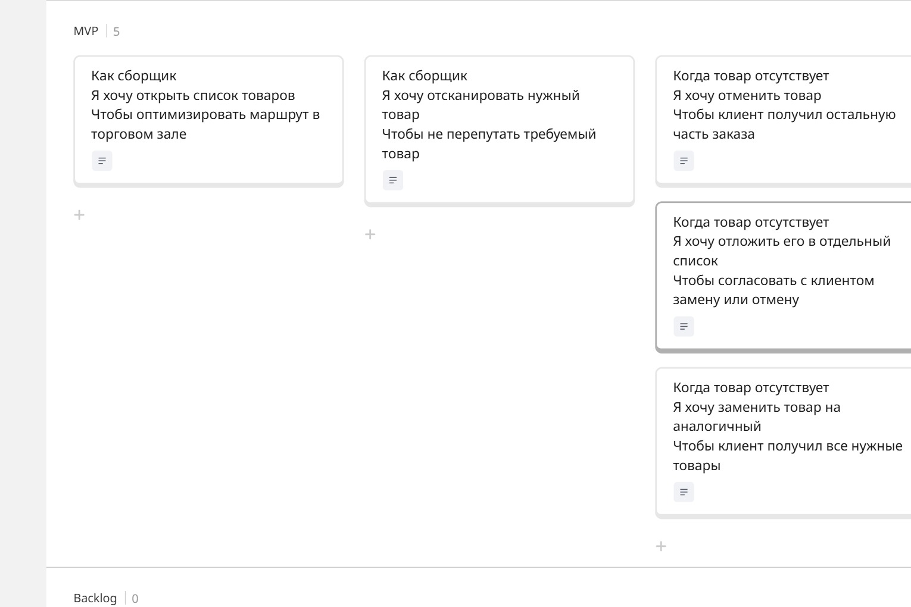
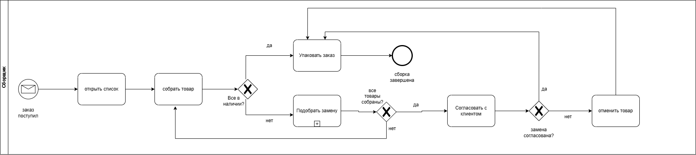
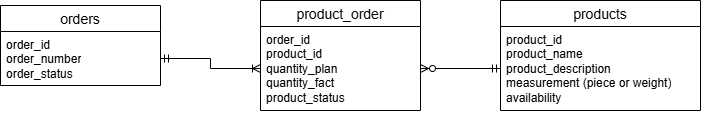
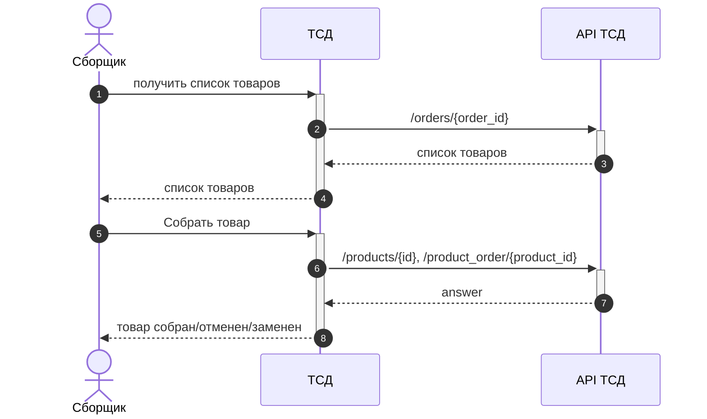

# API Сервиса сборки заказов (Терминал сбора данных — ТСД)

REST API для мобильного терминала сборщика заказов в торговом зале супермаркета. 
Проект демонстрирует проектирование реляционной базы данных, бизнес процесс, функциональные требования и автоматическую генерацию CRUD-эндпоинтов.

## 🛠 Технологический стек
* **База данных:** PostgreSQL 15 (Alpine)
* **API Engine:** PostgREST v12 (автоматический REST API поверх схемы БД)
* **Документация:** OpenAPI 3.1 (Swagger UI)
* **Инструменты тестирования:** Postman (проведение интеграционных тестов, валидация статус-кодов и структуры JSON-ответов)
* **Проектирование и архитектура:** Draw.io (BPMN), Miro (User Story Map), PlantUML
* **Контейнеризация & Окружение:** Docker, Docker Compose (изоляция сервисов и развертывание инфраструктуры одной командой)

### 🗺 Карта пользовательских историй (User Story Map)

Функциональные и нефункциональные требования включая, критерии приемки (acceptance criteria) и сценарии приемки
* 🔗 [Открыть интерактивную карту USM в Miro](https://miro.com) (https://miro.com/app/board/uXjVHdOV_P4=/?share_link_id=672913218240)



---

### 🔄 Моделирование бизнес-процесса (BPMN 2.0)
Для визуализации логики работы приложения спроектирована BPMN-схема процесса «Сборка заказа в торговом зале».

* 🔗 [Открыть исходный файл BPMN в Draw.io](https://diagrams.net) (https://drive.google.com/file/d/1n5CwEK7T32-OqkT4NhCN5YdMoTxH7EhC/view?usp=sharing)



---

### 📊 Схема базы данных (ER-Диаграмма)
Спроектирована модель базы данных (в третьей нормальной форме)



## 🚀 Как запустить проект локально
1. Убедитесь, что у вас установлены Docker и Docker Compose.
2. Склонируйте репозиторий и выполните команду в терминале:
   ```bash
   docker compose up -d
   ```
3. Проект развернется на следующих портах:
   * **API Сервис:** `http://localhost:3000`
   * **Интерактивный Swagger UI:** `http://localhost:8080`

## 📋 Интеграционные сценарии (Тестирование в Postman / cURL)
В репозитории приложен файл `openapi.yaml` с целевым дизайном для ТСД. Тестирование логики PostgREST (табличного API) включает шаги:
* **Создание товара:** `POST /products`
* **Создание заказа:** `POST /orders`
* **Наполнение состава:** `POST /product_order`
* **Получение заказа сборщиком (с JOIN товаров):** `GET /product_order?order_id=eq.1&select=...,products(*)`
* **Фиксация факта сборки весового товара:** `PATCH /product_order?order_id=eq.1&product_id=eq.777` (с передачей точного веса, например `1.480`).

* ## 🔄 Диаграмма последовательности


